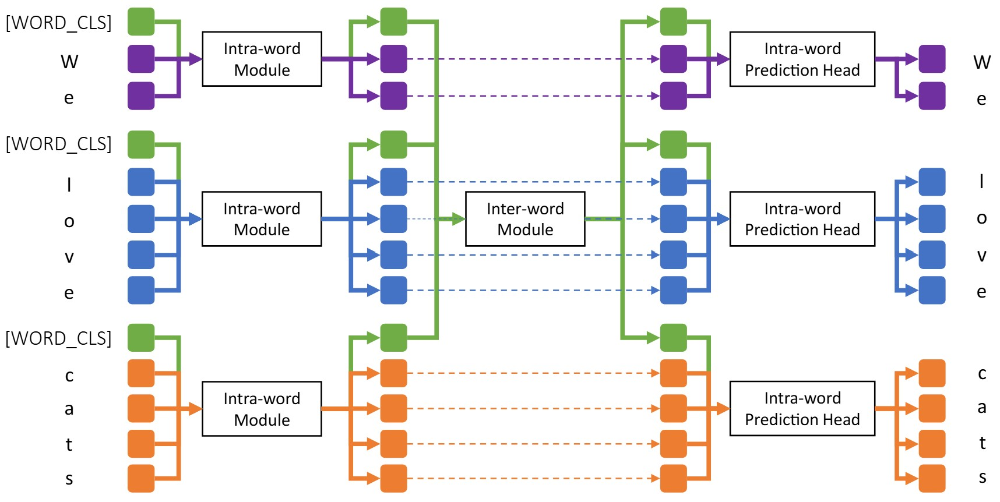

# Hierarchical Language Model

Unofficial PyTorch implementation for paper *From Characters to Words: Hierarchical Pre-trained Language Model for Open-vocabulary Language Understanding*, accepted by *ACL 2023*.

### [[Paper & Supplementary Material](https://aclanthology.org/2023.acl-long.200.pdf)]
<p align="center">
  
</p>

### Abstract
Current state-of-the-art models for natural language understanding require a preprocessing step to convert raw text into discrete tokens. This process known as tokenization relies on a pre-built vocabulary of words or sub-word morphemes. This fixed vocabulary limits the model’s robustness to spelling errors and its capacity to adapt to new domains. In this work, we introduce a novel open-vocabulary language model that adopts a hierarchical two-level approach: one at the word level and another at the sequence level. Concretely, we design an intra-word module that uses a shallow Transformer architecture to learn word representations from their characters, and a deep inter-word Transformer module that contextualizes each word representation by attending to the entire word sequence. Our model thus directly operates on character sequences with explicit awareness of word boundaries, but without biased sub-word or word-level vocabulary. Experiments on various downstream tasks show that our method outperforms strong baselines. We also demonstrate that our hierarchical model is robust to textual corruption and domain shift.


### Requirements

```Shell
conda create -n hlm python=3.9 -y
conda activate hlm
pip install -r requirements.txt
```

### Data Pre-Processing
```bash
python preprocess_data.py --csv_file ./data/sample_pretrain_data_raw.csv \
                          --out_file ./data/sample_pretrain_data_processed.csv
```
### Pre-Training
```bash
torchrun --nproc_per_node 8 pretrain.py --config_json ./config/config_pretrain.json
```

### Fine-Tuning
Benchmark on GLUE tasks:
```bash
sh scripts/run_glue.sh
```

Benchmark on CoNLL-2003 NER task:
```bash
sh scripts/run_ner.sh
```

### Citation

```
@inproceedings{sun-etal-2023-characters,
    title = "From Characters to Words: Hierarchical Pre-trained Language Model for Open-vocabulary Language Understanding",
    author = "Sun, Li  and
      Luisier, Florian  and
      Batmanghelich, Kayhan  and
      Florencio, Dinei  and
      Zhang, Cha",
    booktitle = "Proceedings of the 61st Annual Meeting of the Association for Computational Linguistics (Volume 1: Long Papers)",
    month = jul,
    year = "2023",
    address = "Toronto, Canada",
    publisher = "Association for Computational Linguistics",
    doi = "10.18653/v1/2023.acl-long.200",
    pages = "3605--3620"
}
```

### Reference
Shiba: https://github.com/octanove/shiba

DeBERTa: https://github.com/microsoft/DeBERTa
